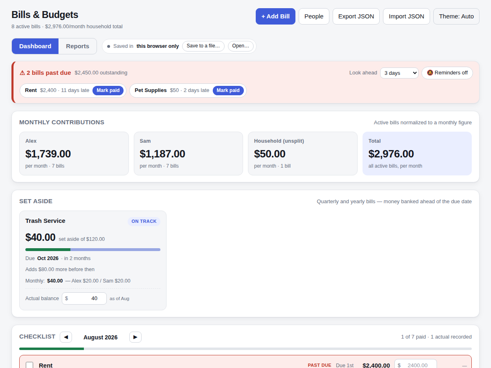
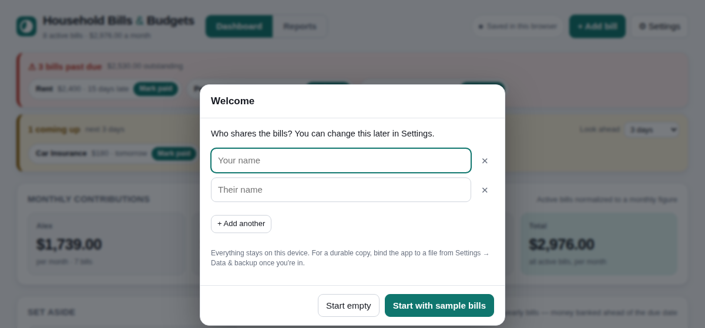
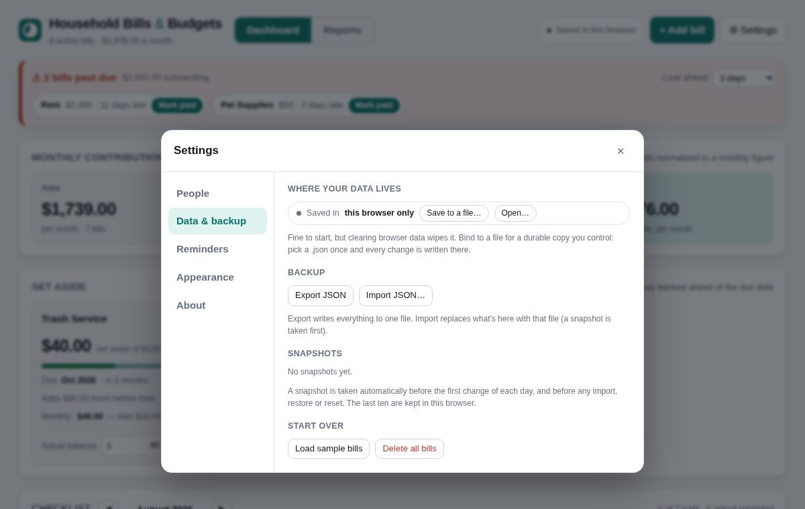
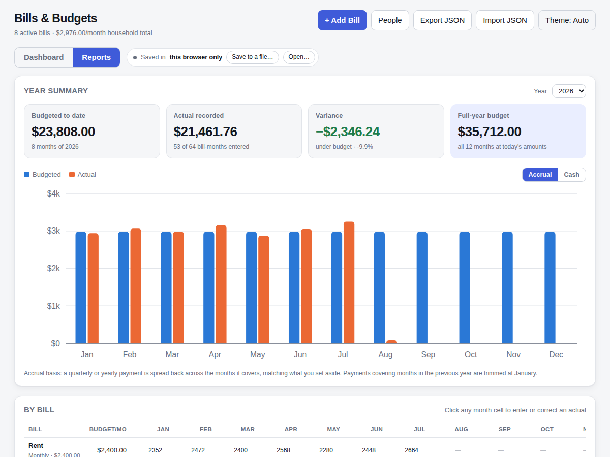

<p align="center">
  
</p>

# Household Bills &amp; Budgets

A bill tracker for two or more people who share a home, in a single HTML file.
No build step, no server, no account, no dependencies, no telemetry. Open it in
a browser and it works; bind it to a JSON file and your data is yours.

**[Try it](https://thatsatechnique.github.io/household-bills/)** · it runs entirely in your browser, nothing is uploaded.



## Why

Shared bills are rarely split evenly, quarterly bills sneak up on you, and
"what did we actually pay last year" is a question spreadsheets answer badly.
This does three things well:

1. **Uneven splits.** Each bill is divided by percent or by fixed dollar
   amounts, and the Monthly Contributions panel tells each person what to
   put in every month, with every bill normalized to a monthly figure.
2. **Set-aside funds.** A $120 quarterly bill shows up as $40/month to bank,
   with a running balance, the next due date, and a funded / on track /
   short status. The money is there when the bill lands.
3. **Budget vs actual.** Record what each bill really cost, month by month,
   and see the year roll up by month and by bill, with variance and a trend
   line per bill.

Plus the plumbing that keeps bills paid on time: a per-month checklist,
past-due highlighting, a look-ahead alert bar, a tab-title badge, and optional
desktop notifications.

## Quick start

Either use the hosted copy above, or keep it entirely local:

```
git clone https://github.com/thatsatechnique/household-bills
cd household-bills
open index.html        # macOS — or double-click it, or drag it into a browser
```

On first run it asks who shares the bills, then offers sample bills mapped onto
those names or an empty start. Everything else lives under **Settings**.



In Chrome or Edge you can install it as an app from the address bar; it then
opens in its own window with the icon on your dock or home screen.

### Keeping your data

The status pill in the header tells you where your data lives; click it for
**Settings → Data &amp; backup**.



| Chip says | What it means |
|---|---|
| **Saved in this browser** | `localStorage`. Fine for a start, but clearing browser data wipes it. Click **Save to a file…** |
| **Saving to household-bills.json** | Every change is written to a file you chose (File System Access API, Chrome/Edge). Put it in a synced folder and it's backed up. |
| **needs permission** | The browser forgot the file grant. Click **Reconnect**; edits made meanwhile were kept locally. |
| **Preview panel** | You're inside a sandboxed iframe (some app previews). File pickers are blocked there — open the file directly in a tab. |
| **Changes are not being saved** | Storage is blocked entirely. Export JSON before you leave. |

Safari and Firefox don't have the File System Access API; there the app
stays on `localStorage` and offers Export/Import JSON for backups.

Whatever the storage, a **snapshot** is taken before the first change of each
day and before any import, restore or reset; the last ten can be restored from
Settings. And the JSON carries a `version` field so future format changes can
migrate old files.

## How it works

### Splits

A bill can be split by **percent** (must sum to 100 before you can save; the
running total goes red until it does) or by **amount** (a mismatch against the
bill total warns but saves). Both figures are always stored; the app derives
the one you didn't type. New bills open with an even split, odd cent on the
first person.

### Periods and cycles

| Period | Monthly figure | Shows on the checklist |
|---|---|---|
| Weekly | × 52 ÷ 12 | every month |
| Monthly | × 1 | every month |
| Quarterly | ÷ 3 | its four cycle months |
| Yearly | ÷ 12 | one month a year |

Quarterly and yearly bills carry a **Billed in** month. That drives the
checklist, the alerts, and the set-aside fund. Details in
[docs/data-format.md](docs/data-format.md).

### Reports



The year chart compares the normalized monthly budget with what was recorded.
**Accrual** (default) spreads a quarterly payment across the months it covers
so the bars line up; **Cash** shows the payment in the month it was made. The
by-bill grid is editable — click any month to enter or correct an actual — and
carries a sparkline per bill.

### Alerts

Past-due and coming-up bills sit at the top of the dashboard with one-click
**Mark paid**. Near the end of a month the window rolls into next month.
Desktop notifications fire once a day while the tab is open; there is no
background push (it's a static file), so pin the tab.

## Data

One JSON document: settings, people, bills. Export JSON / Import JSON move
it around. The format is documented in
[docs/data-format.md](docs/data-format.md) and is stable across versions;
missing fields are filled with sensible defaults on load.

Nothing leaves your machine. There is no telemetry, no network request of any
kind, and no third-party script.

## Development

```
npm install
npm run test:install     # downloads Chromium for Playwright, once
npm test
```

Seven Playwright suites, about 240 assertions, run against the real file in a
headless browser with a frozen clock, served over a local http port. They cover contribution math, the split
editor, month-end and short-month edge cases, the file-binding lifecycle
(bind, write-through, reload-adopts-file, permission lapse, disconnect), the
set-aside fund math, accrual vs cash reporting, first-run onboarding, snapshots
and restore, and the sandboxed-iframe and blocked-storage cases.

### Publishing your own copy

The repo ships a GitHub Pages workflow. Enable Pages for the repository
(Settings → Pages → Source: *GitHub Actions*), push to `main`, and the app is
served from the repo root. Replace `thatsatechnique` in this README with your
username.

The app is one file on purpose. Keep it that way: inline CSS and JS, no
framework, no bundler. If a change needs a library, it probably isn't the
right change for this project.

## Roadmap ideas

Not planned, but reasonable next steps if someone wants them:

* Per-person share of *actuals* (not just budget) in the reports
* CSV export of the by-bill grid
* Importer for a spreadsheet of past months
* Multiple households / profiles in one file

## License

MIT — see [LICENSE](LICENSE).
